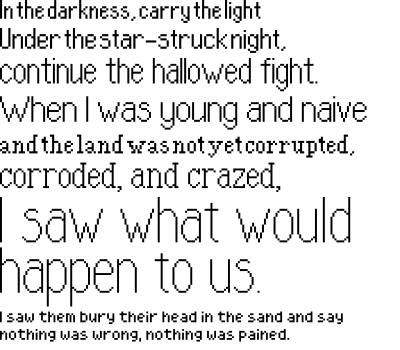

# Northrup

Northrup is a pixel font inspired by classic video games such as the <i>Earthbound</i> series. It boasts eight different variants, each representing one of five different optical sizes and two widths, and either a serif or sans-serif subset.

The main size, <i>Northrup Extended</i>, has a diverse set of features. It supports a wide range of languages, including the Latin, Greek, Cyrillic, and Inuit Syllabic scripts, and a diverse set of special characters, amounting to 1027 total glyphs.

It was developed for a long-abandoned game project of mine - but feel free to use it for whatever you want.
</h2>
